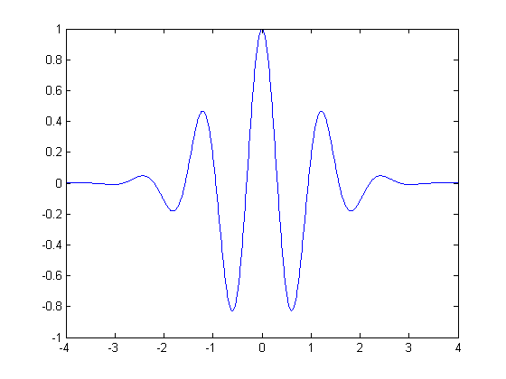
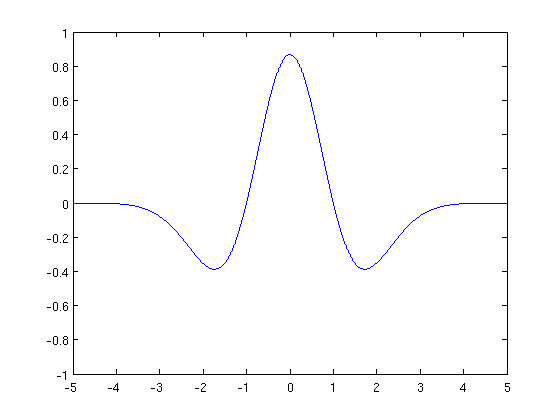

```{r setup, include=FALSE}
knitr::opts_chunk$set(echo = FALSE)
```

# Conhecendo o Wavelet
  
- *Wavelet* é uma função capaz de decompor e representar outra função (*eg.: uma série de dados*) originalmente descrita no domínio do tempo. 

- A decomposição de uma função *wavelets* é conhecida como "transformada wavelet" e tem suas variantes contínuas e discretas. 

- Devido a sua capacidade de decompor as funções (domínio da frequência, domínio do tempo), este tipo de função possui ampla aplicação:
  - Processamento de sinais:
     * Compreensão de dados.
     * Eliminação de ruído.
     * Separação de componentes no sinal.
     * Identificação de singularidade.
     * Detecção de auto-semelhança.
     
---

# Fourier vs Wavelets

\begin{block}{}
\begin{itemize}

  \item Fourier: podemos extrair apenas informações sobre o domínio da frequência, mas não podemos saber "quando" no tempo ocorre essas frequências.
  \item Wavelets: podemos extrair informações sobre o domínio da frequência e do tempo. 
  
\end{itemize}
\end{block}

---

# Características da função Wavelets
  
Para ser considerada uma *wavelet*, uma função deve atender as seguintes características:
  
1. A área total sob a curva da função é 0, ou seja $$\int_{- \infty}^{\infty} \psi(t) dt = 0.$$
  
2. A energia da função finita, ou seja, $$\int_{- \infty}^{\infty} |\psi(t)|^2 dt < 0, \, L \in \mathbb{N}.$$
  
Isto equivale a dizer que $\psi(t)$ é um quadrado integrável.

---

# Características 

* Essa característica dita energia concentrada em uma região finita é que diferencia a análise wavelets da análise de Fourier.

* Uma maneira alternativa de expressar a característica de regularidade é dizer que a transformação wavelet é um operador local no domínio do tempo.

* Para ser utilizada na análise de sinais a função wavelet precisa de outra característica que é chamada de **condição de admissibilidade** a qual permite a transformação inversa de wavelet.

---



---

[width = 800px]

---

# Transformada de wavelet contínua

$$W (a, b) = \int_{- \infty}^{\infty} f(t) \psi_{a,b}^* (t) dt.$$
  
Onde **a** e **b** são parâmetros reais. (*) indica o conjugado complexo. Se definirmos $\psi_{a,b}(t)$ como:
$$\psi_{a,b} = \frac{1}{\sqrt{|a|}} \psi^* \left(\frac{t - b}{a} \right)$$  
  
Podemos reescrever a transformada como produto interno das funções $f(t)$ e $\psi_{a,b}(t):$

$$W(a,b) = \langle f(t), \psi_{a,b}(t) \rangle = \int_{- \infty}^{\infty} f(t) \psi^*_{a,b} (t) \, dt$$
  
Esta função $\psi(t)$ equivale a $\psi_{1,0}(t)$ é chamado de *wavelet mãe*, enquanto as outras funções $\psi_{a,b}(t)$ são chamadas de *wavelets filhas*.
  
---

* O parâmetro **b** indica que a função $\psi(t)$ foi transladada no eixo t de uma distância equivalente a b. 

* O parâmetro **a** causa uma mudança de escala, aumentando (se a > 1) ou diminuindo (se a < 1).

* No domínio do tempo, a transformada de wavelet é uma medida da correlação entre o sinal $f(t)$ e as wavelets filhas.
  
---

O termo $\frac{1}{\sqrt{|a|}}$ é um fator de normalização que garante que $\psi_{a,b}(t)$ seja independente de **a** e **b**, tal que: $$ \int_{- \infty}^{\infty} = |\psi_{a,b}(t)|^2 \, dt = \int_{- \infty}^{\infty}  |\psi(t)|^2 \, dt$$

---

# Transformada inversa de wavelet

* Como usamos wavelets para transformar uma função, precisamos da transformada inversa (com o intuito de recompor o sinal do domínio do tempo a partir da sua decomposição). Temos $\Psi$ como a transformada de Fourier da função $\psi(t)$:
  
$$\Psi(\omega) = \int_{- \infty}^{\infty} \psi(t)e^{-i \omega t} \, dt = \sqrt{a} . \Psi(a \omega) . e^{-i \omega t},$$
  
onde $\omega = \frac{2 \pi}{a}$.

---

E se W(a, b) for a transformada de wavelet da função f(t) usando a wavelet $\psi(t)$, então temos que a transformada inversa dada por:
$$f(t) = \frac{1}{C} \int_{-\infty}^{\infty} \int_{-\infty}^{\infty} \frac{1}{|a|^2} W(a,b) \psi_{a,b}(t) \, da \, db $$  
  
onde $$C = \int_{-\infty}^{\infty} \frac{|\Psi(\omega)|^2}{|\omega|} \, dw.$$

# Transformada de wavelet discreta
  
É derivada da transformada contínua fazendo-se **a** e **b** variáveis discretas, usualmente usamos:
  
* $a = N^j$
* $b = kMa$ com $j, k \in \mathbb{N}$
  
a wavelet mãe resultante é uma matriz de valores h[j,k] relacionada à wavelet contínua $\psi(t)$  pela expressão $$h[j, k] = N^{\frac{-j}{2}} . \psi \left(\frac{t}{N^j} - kM\right),$$
  
quanto mais próximo de 1 o valor de N, mais a versão discreta se aproxima da versão contínua. De forma similar,  a transformada discreta é uma matriz de coeficientes $W_{j,k}$ dados por $$W[j,k] = \sum_{k = 2}^m \sum_{j = 1}^n f[k] . h^*[j,k] = \langle f,h \rangle$$
  
# Aplicação computacional   

* Bancos de dados: PETRA4 e ITSA4.
  
* Área de finanças: dados de ações (período: Janeiro/2018 até Novembro/2018).
  
* A série será considerada em um período de 12 meses, pois os dados são coletados mensalmente.

---

## Possibilidades da análise:

* O que está análise nos permite?
 - Estimar o grau de correlação entre as variáveis em uma quantidade maior de frequências,  verificando o comportamento da relação ao longo do tempo. 
 - Não precisamos assumir que os dados são estacionários. 
 
 * Pacotes utilizados:
   
library(readr)
  
library(WaveletComp)
  
library(astsa)
  
# Analisando as séries:

## Ações PETR4:
  
```{r, include=FALSE}
setwd("~/Exten. de modelos/CE092_Seminario-main/CE092_Seminario-main")
library(readr)
library(WaveletComp)
library(astsa)

da1 <- read.csv("PETR4 Dados Historicos (1).csv", 
                header = T, sep = ";", dec = ",")

da2 <- read.csv("ITSA4 Dados Historicos (1).csv", 
                header = T, sep = ";", dec = ",")

```

```{r, echo = TRUE}
# Variável de interesse
petr4 <- da1$Maxima
```
---

```{r, echo = TRUE}
ts.plot(ts(petr4, start(2012, 1)))
```

---

```{r, results = "hide", echo = TRUE}
# Inserindo frequência:
petr4 <- periodic.series(start.period = 1, end.period = 12)

data <- data.frame(petr4 = petr4)
```
---

```{r, results = "hide", echo = TRUE}
# Aplicando a transformada:
my.w <- analyze.wavelet(data, "petr4", loess.span = 0, 
                       dt = 1, make.pval = T, n.sim = 10)
```

```{r, include = FALSE}
# Aplicando a transformada:
my.w <- analyze.wavelet(data, "petr4", loess.span = 0, 
                       dt = 1, make.pval = T, n.sim = 10)
```
---

```{r, results = "hide", echo = TRUE}
reconstruct(my.w, plot.waves = F, lwd = c(1,2), legend.coords = "bottomleft")
```

```{r, include = FALSE}
#série original conjuntamente com a série reconstruída apenas com os períodos #significantes.
reconstruct(my.w, plot.waves = F, lwd = c(1,2), legend.coords = "bottomleft")
```

---

```{r, results = "hide", echo = TRUE}
wt.image(my.w, color.key = "quantile", n.levels = 250, legend.params = list(lab = "wavelet power levels", mar = 4.7))

```

```{r, include = FALSE}
# Para plotar o espectro de potência da Wavelet faremos:
wt.image(my.w, color.key = "quantile", n.levels = 250, legend.params = list(lab = "wavelet power levels", mar = 4.7))
```
---

## Ações ITSA4:

```{r, echo = TRUE}
# Variável de interesse
itsa4 <- da2$Maxima
```
---

```{r, echo = TRUE}
ts.plot(ts(itsa4, start(2012, 1)))
```


---

```{r, results = "hide", echo = TRUE}
# Inserindo frequência:
itsa4 <- periodic.series(start.period = 1, end.period = 12)

data <- data.frame(itsa4 = itsa4)
```
---

```{r, results = "hide", echo = TRUE}
# Aplicando a transformada:
my.w <- analyze.wavelet(data, "itsa4", loess.span = 0, 
                       dt = 1, make.pval = T, n.sim = 10)
```

```{r, include = FALSE}
# Aplicando a transformada:
my.w <- analyze.wavelet(data, "itsa4", loess.span = 0, 
                       dt = 1, make.pval = T, n.sim = 10)
```
---

```{r, results = "hide", echo = TRUE}
reconstruct(my.w, plot.waves = F, lwd = c(1,2), legend.coords = "bottomleft")
```

```{r, include = FALSE}
#série original conjuntamente com a série reconstruída apenas com os períodos #significantes.
reconstruct(my.w, plot.waves = F, lwd = c(1,2), legend.coords = "bottomleft")
```

---

```{r, results = "hide", echo = TRUE}
wt.image(my.w, color.key = "quantile", n.levels = 250, legend.params = list(lab = "wavelet power levels", mar = 4.7))

```

```{r, include = FALSE}
# Para plotar o espectro de potência da Wavelet faremos:
wt.image(my.w, color.key = "quantile", n.levels = 250, legend.params = list(lab = "wavelet power levels", mar = 4.7))
```

# Conclusão

* Ao longo do curso nos deparamos com diversos transformadores de regiões de 
probabilidade. *(eg.: método Jacobiano)*.
  
* Esta aplicação é muito utilizada na área da física e mercado financeiro.

* Conseguimos ter a percepção de que o "mapa de calor" proveniente da Wavelet é uma boa alternativa para verificar os coeficientes que possuem maiores pesos.

# Referências
  
Morettin, Pedro A. (1999). ONDAS E ONDALETAS. Da Análise de Fourier à Análise de ondaletas 1 ed. [S.l.]: edUSP. 276 páginas. ISBN 8531405092
  
SHENG, Yunlong (2000). Wavelet Transform. cap. 10 - in Poularikas, A. - THE TRANSFORMS AND APPLICATIONS HANDBOOK 2 ed. Boca Raton: CRC Press
  

